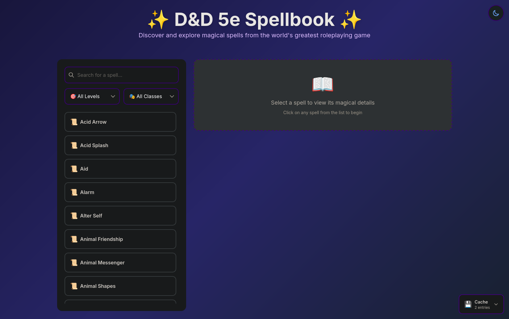
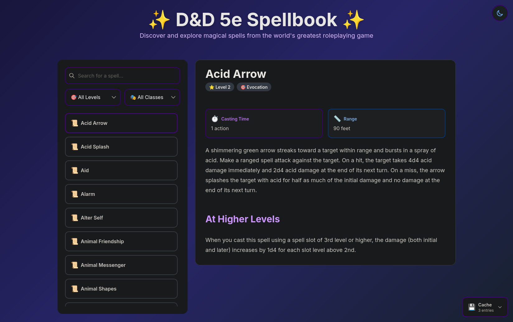
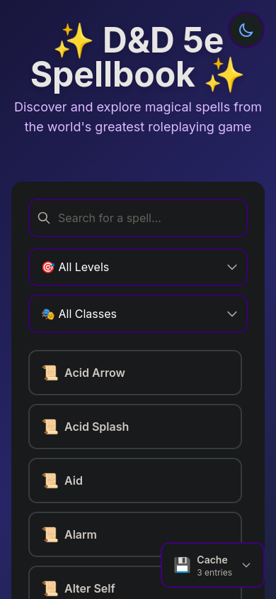
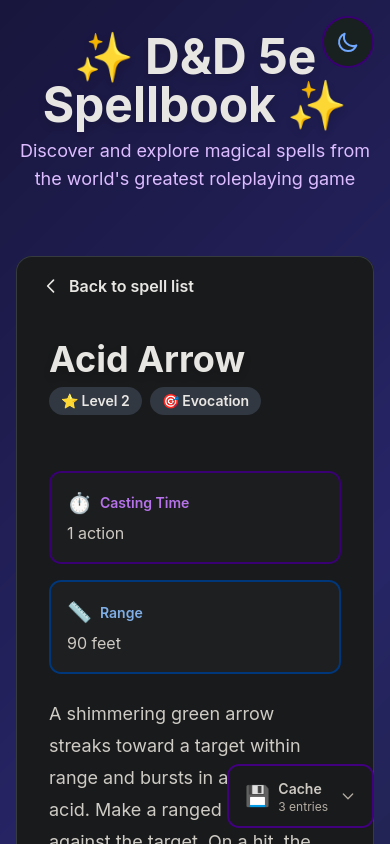
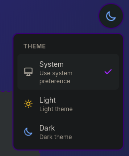
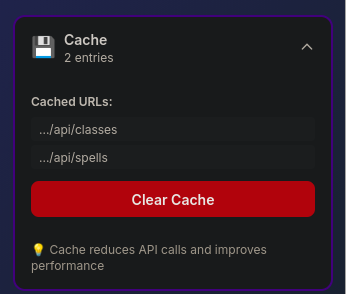

# D&D 5e Spellbook

A web app for browsing D&D 5e spells. Built with Svelte 5, Vite, and Tailwind CSS.

## Screenshots

### Desktop
<table>
  <tr>
    <td width="50%">
      
      <p align="center"><em>Spell list with search and filters</em></p>
    </td>
    <td width="50%">
      
      <p align="center"><em>Detailed spell view with markdown</em></p>
    </td>
  </tr>
</table>

### Mobile
<table>
  <tr>
    <td width="50%">
      
      <p align="center"><em>Responsive spell list</em></p>
    </td>
    <td width="50%">
      
      <p align="center"><em>Spell details with back button</em></p>
    </td>
  </tr>
</table>

### Features
<table>
  <tr>
    <td width="50%">
      
      <p align="center"><em>Light, dark, and system theme options</em></p>
    </td>
    <td width="50%">
      
      <p align="center"><em>Cache stats widget</em></p>
    </td>
  </tr>
</table>

## Features

- Browse all spells from the D&D 5e API
- Search by name
- Filter by spell level or class
- View detailed spell information
- Light/dark theme (or use system preference)
- Caching to avoid hammering the API
- Works on mobile and desktop

## Setup

You need Node.js (v16+) and npm.

```bash
# Install dependencies
npm install

# Run dev server
npm run dev

# Build for production
npm run build

# Preview production build
npm run preview
```

## Project Structure

```
src/
├── lib/
│   ├── CacheStats.svelte   # Cache stats widget
│   ├── Filters.svelte      # Search and filter controls
│   ├── SpellDetail.svelte  # Spell detail view
│   ├── SpellList.svelte    # Spell list
│   ├── ThemeToggle.svelte  # Theme switcher
│   ├── api.svelte.js       # API calls
│   ├── cache.svelte.js     # Caching
│   └── markdown.svelte.js  # Markdown rendering
├── App.svelte              # Main app
├── app.css                 # Global styles
├── main.js                 # Entry point
└── types.svelte.js         # Type definitions
```

The code follows single responsibility principle - each file does one thing. Components handle UI, utilities handle logic.

## Tech Stack

- Svelte 5
- Vite 7
- Tailwind CSS 4
- marked.js (for markdown rendering)
- [D&D 5e API](https://www.dnd5eapi.co/)

## How It Works

### Caching
API responses are cached in memory to avoid rate limits:
- Spell lists: 10 minutes
- Spell details: 15 minutes
- Class list: 30 minutes

There's a little cache stats widget in the bottom-right corner if you want to see what's cached.

### Themes
You can pick light mode, dark mode, or just use your system preference. Your choice gets saved in localStorage.

### Code
Uses JSDoc for type hints instead of TypeScript. Each module has a single responsibility - API stuff in `api.svelte.js`, markdown rendering in `markdown.svelte.js`, etc.

## TODO

- [ ] Docker setup for self-hosting
- [ ] Maybe add spell favorites/bookmarks?
- [ ] Export spell lists?

## Credits

Spell data from [D&D 5e API](https://www.dnd5eapi.co/). D&D is owned by Wizards of the Coast.
